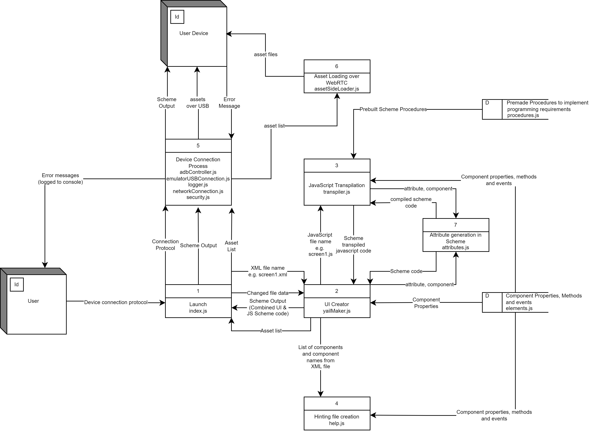

## Data Flow Diagram

## Further Notes

1. Application creates a hidden folder ".aijs"
2. Files are created in this folder
    * code.scm - this is an output of the generated scheme code for an app
    * sequence.info - this file tries to help maintain sync between the device and this application. Data sent between devices need to have a numerical increasing flag associated with it. The device will accept an 'off by one error'.
    * assets.list - a list of files needed to be uploaded to the device for an application
3. To connect to devices using 6 character code the system uses webRTC. 
4. In a normal App Inventor App, asset files are stored on the MIT server, the device is sent a list of files and the devices pulls them off this server. By not hosting files on MIT there is no direct way of sending asset files to the device. This was a complicated (yet fun) problem to overcome. It works like this to upload an asset directly over webRTC to the device.
    1. The asset file is encoded into base64 (text). WebRTC only allows text transfer so this must occur.
    2. This base64 is inserted into a carefully crafted scheme file.
    3. This scheme file with the base64 payload is uploaded over webrtc into the device. This is because the App Inventor App on the device automatically treats any data over webRTC as scheme text file data to be processed and presented.
    4. The App Inventor App on the device launches the uploaded scheme file. This file runs a webviewer with inbuilt javascript that is carrying the base64 data.
    5. The javascript converts the base64 asset data back into a binary file on the actual device.
    6. The javascript then uploads the file from the webviewer to the device App Inventor app storage by using the localhost connection that runs on the App Inventor App (essentially emulating the type of upload that happens over usb connections).
    7. This has only being tested on Android devices. Hopefully it would work on iOS.
